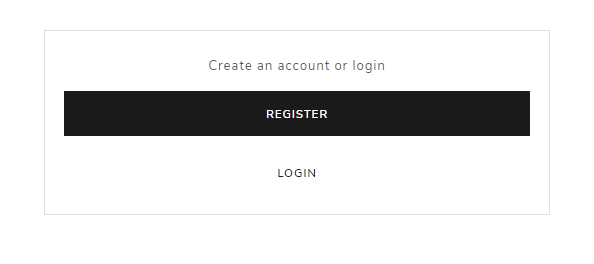
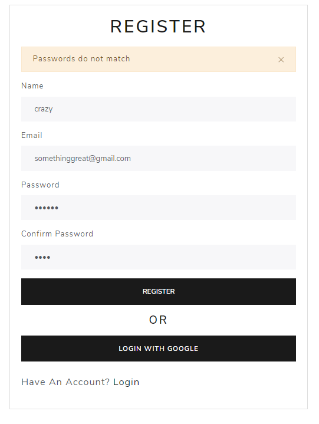
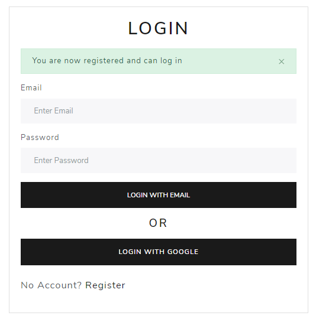
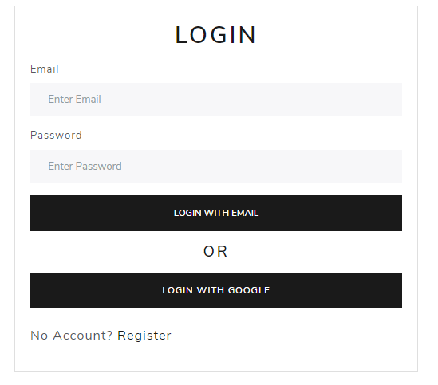
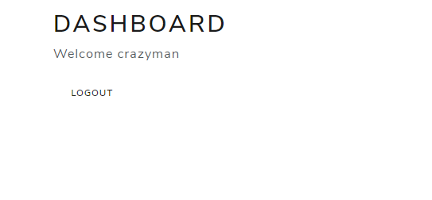

# Node.js & Passport Login

This is a user login and registration app using Node.js, Express, Passport, Mongoose, EJS and some other packages.
This also implements Google Oauth.

### Version: 2.0.0

### Usage

```sh
$ npm install
```

```sh
$ npm start
# Or run directly by
$ node app

# Visit http://localhost:5000
```

### MongoDB

Create a ".env" file and add your mongodb connection string as DB_CONNECTION , local or Atlas

### Google auth

create ".env" file and add google client id as GOOGLE_CLIENT_ID and GOOGLE_CLIENT_SECRET

### Sample Images
#### Dashboard


#### Register Page




#### Login Page


#### Successful login

